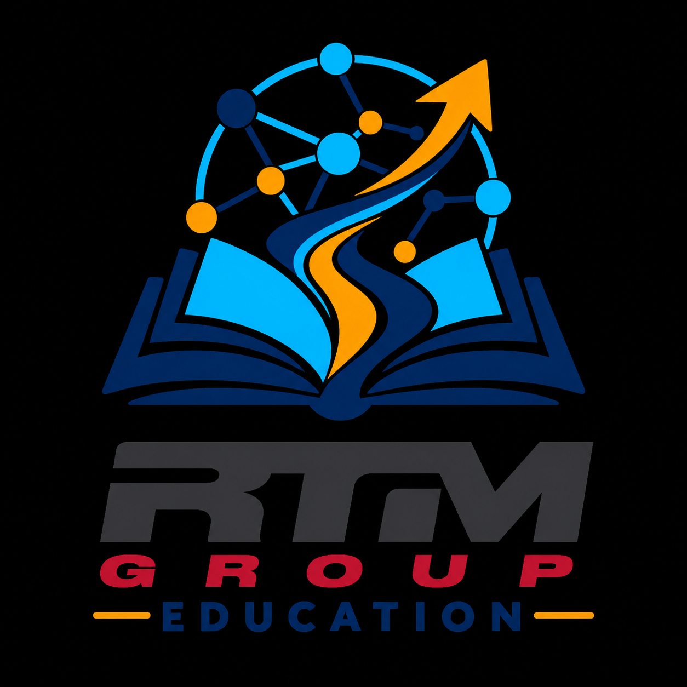
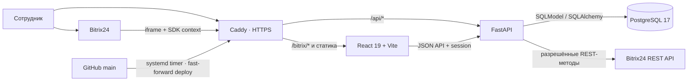
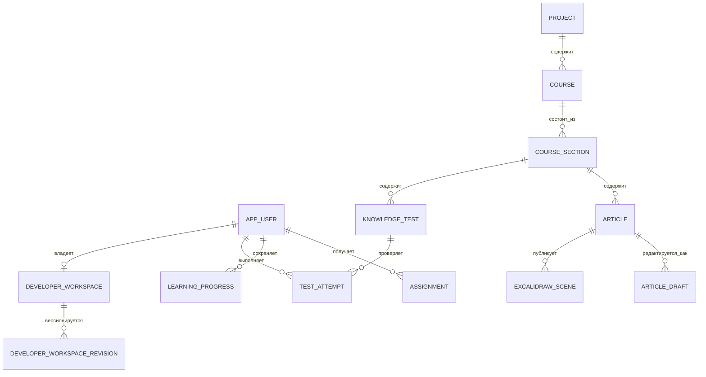

<p align="center">
  
</p>

<h1 align="center">RTM Education Bitrix</h1>

<p align="center">
  Корпоративное обучение, база знаний и контроль ознакомления сотрудников внутри Bitrix24.
</p>

<p align="center">
  <a href="https://github.com/andreyabramovworks-commits/RTM-education-Bitrix/actions/workflows/ci.yml"></a>
  <a href="https://rtmgroupdocs.fvds.ru/api/health"></a>
  
  
  
  <a href="LICENSE"></a>
</p>

> Production: [приложение](https://rtmgroupdocs.fvds.ru/bitrix/app) · [health](https://rtmgroupdocs.fvds.ru/api/health) · [readiness](https://rtmgroupdocs.fvds.ru/api/ready)

## Навигация

- [Возможности](#для-чего-нужен-проект-и-что-он-умеет)
- [Архитектура](#архитектура-проекта)
- [Роли и доступы](#роли-и-доступы)
- [Локальный запуск](#локальный-запуск)
- [Разработка и проверки](#разработка-и-миграции)
- [Production и эксплуатация](#production-и-эксплуатация)
- [История версий](VERSIONS.md)
- [Интеграция с Bitrix24](deploy/BITRIX24.md)
- [Лицензия](#лицензия-и-сторонние-компоненты)

## Для чего нужен проект и что он умеет

RTM Education Bitrix — обучающая платформа для создания, публикации и прохождения учебных материалов в веб-приложении и внутри Bitrix24. Проект поддерживает полный цикл обучения: подготовку контента, назначение курсов пользователям, изучение статей, прохождение тестов, сохранение прогресса и работу с результатами.

Основные функциональные возможности:

- иерархия учебного контента: проекты → курсы → разделы → статьи и тесты;
- статьи с несколькими страницами и интерактивными визуальными материалами;
- редактор на базе Excalidraw для схем, диаграмм и других учебных сцен;
- серверное хранение Excalidraw-сцен, ревизии, черновики, публикация и общий просмотр опубликованных материалов;
- тесты с настраиваемыми параметрами, вопросами, вариантами ответов, правильными ответами и проходным результатом;
- сохранение ответов, баллов, статуса прохождения, времени начала и завершения попытки;
- повторное прохождение и сброс попыток для пользователей с соответствующими полномочиями;
- назначения обучения, статусы выполнения и процент прогресса пользователя;
- данные для аналитики: прогресс, завершение материалов, результаты тестов и история попыток;
- роли и разграничение доступа: `developer`, `admin`, `editor`, `teacher` и `student`;
- интеграция с Bitrix24 для определения пользователя, проверки доступа и обращения к разрешённым методам REST API;
- импорт и синхронизация проектов, курсов, статей, тестов, ролей, назначений, прогресса и попыток из legacy-структуры RTM Education;
- отдельное приватное developer-пространство Excalidraw с версионированием и резервным копированием;
- расширяемая серверная модель для добавления новых типов материалов, проверок, отчётов и интеграций.

Часть возможностей уже реализована в серверной модели и API, а пользовательский интерфейс продолжает развиваться. Поэтому при изменениях следует проверять одновременно функциональность frontend, API, миграции и совместимость с legacy-данными.

## Архитектура проекта



### Компоненты

- `frontend/` — React 19 и Vite. Содержит современную оболочку приложения и legacy-ресурсы RTM Education, которые загружаются через React-host.
- `backend/` — FastAPI-приложение. Содержит HTTP API, авторизацию Bitrix24, проверку ролей, бизнес-правила, синхронизацию и health-check endpoints.
- `backend/app/models.py` — SQLModel-модели основной предметной области: пользователи, проекты, курсы, разделы, статьи, сцены, тесты, назначения, прогресс и попытки.
- `backend/alembic/` — последовательность миграций PostgreSQL.
- `compose.yaml` — связка контейнеров `db`, `backend`, `frontend` и `caddy` в общей внутренней сети.
- `deploy/` — Caddy-конфигурация, bootstrap сервера, systemd timers/services, обновление production и резервное копирование.

### Как проходит запрос

1. Пользователь открывает приложение напрямую или в iframe Bitrix24.
2. Caddy принимает HTTP/HTTPS-запрос: frontend-ресурсы отдаёт сам, а запросы `/api/*` направляет в FastAPI.
3. Backend определяет Bitrix24-контекст и текущего пользователя, создаёт или обновляет локальную запись пользователя и устанавливает защищённую серверную сессию.
4. Проверка роли выполняется до операции. Backend не полагается только на скрытие кнопок в интерфейсе.
5. Данные приложения читаются из PostgreSQL. Тяжёлые или структурно изменяемые поля, например вопросы теста и Excalidraw-сцены, хранятся в JSON-колонках с отдельными нормализованными сущностями и связями.
6. Ответ возвращается frontend или встраиваемой странице Bitrix24.

## Технологии и технические решения

| Область | Решение | Назначение |
| --- | --- | --- |
| Пользовательский интерфейс | React 19, React DOM, Vite | Оболочка приложения, навигация и интеграция legacy-интерфейса |
| Визуальный редактор | `@excalidraw/excalidraw` 0.18.0 и встроенная сборка canvas | Редактирование и просмотр учебных схем и сцен |
| API | FastAPI, Uvicorn | HTTP API, health-check, авторизация и серверные операции |
| Модели данных | SQLModel, SQLAlchemy | Типизированное описание сущностей и работа с PostgreSQL |
| База данных | PostgreSQL 17 | Постоянное хранение пользователей, контента, прогресса и результатов |
| Миграции | Alembic | Управляемое изменение схемы базы данных |
| Контейнеризация | Docker Compose | Воспроизводимый запуск всех сервисов |
| Reverse proxy | Caddy 2.10 | HTTPS, маршрутизация и единая внешняя точка входа |
| Интеграция | Bitrix24 Browser SDK и REST API | Встраивание приложения в портал и доступ к разрешённым данным |
| Тестирование | pytest, FastAPI TestClient | Проверка API, ролей, синхронизации, сцен и учебных сценариев |

### Модель данных

Основные связи предметной области выглядят так:



Legacy-идентификаторы сохраняются в нормализованных сущностях и в таблице `legacy_records`. Это позволяет поддерживать старый формат данных и одновременно использовать новую серверную модель.

### Роли и доступы

- `student` — просмотр доступного обучения, прохождение материалов и собственных тестов, обновление собственного прогресса;
- `teacher` — работа с назначениями, прогрессом и проверкой обучения в пределах разрешённых операций;
- `editor` — создание и изменение учебного контента, статей и тестов;
- `admin` — административное управление и назначение ролей, кроме защищённой роли разработчика;
- `developer` — техническое управление системой и приватным developer-пространством.

Проверки доступа находятся на стороне backend. Роль Bitrix24-администратора учитывается при авторизации, а первичная developer-роль защищена отдельными правилами.

### Жизненный цикл учебного материала

Учебный объект создаётся как черновик, связывается с проектом/курсом и разделом, после чего может быть опубликован. Для статьи опубликованная Excalidraw-сцена и рабочий draft хранятся раздельно: редактор может продолжать работу, не изменяя материал, который уже видит учащийся. Публикация переносит draft в опубликованную сцену и увеличивает её ревизию.

Тест хранит настройки и список вопросов в JSON. Попытка пользователя сохраняет ответы, баллы, признак прохождения и даты начала/завершения. Такой формат сохраняет совместимость с legacy-структурой и позволяет расширять формат тестов без немедленного изменения схемы таблиц.

### Excalidraw в проекте

Excalidraw используется как формат и как редактор визуального контента. Проект дополняет его серверной логикой:

- сцены привязаны к статье и ключу страницы;
- опубликованные сцены и черновики хранятся отдельно;
- каждая запись имеет ревизию и дату изменения;
- просмотр статьи использует сохранённую сцену, а не только локальное состояние браузера;
- developer workspace хранится отдельно от учебных статей и имеет собственную историю ревизий;
- backup-скрипты могут сохранять developer workspace в формате `.excalidraw`.

### Legacy-совместимость и синхронизация

Legacy API сохраняет совместимые сущности `rtm_prj`, `rtm_items`, `rtm_roles`, `rtm_assigns`, `rtm_progress`, `rtm_events` и `rtm_attempts`. Синхронизация преобразует эти записи в нормализованные модели PostgreSQL, сохраняя исходные идентификаторы. Поэтому новые функции можно развивать на серверной модели, не ломая накопленные материалы и существующий интерфейс.

## Статус и версии

Проект находится в активной разработке. Ветка `main` — единственный источник production-развёртывания. Версия работающего backend возвращается в поле `version` endpoint `/api/health`; готовность приложения и PostgreSQL проверяется через `/api/ready`. Подробная история изменений, совместимости и важных исправлений находится в [`VERSIONS.md`](VERSIONS.md).

### Что уже работает

| Контур | Состояние |
| --- | --- |
| Учебная оболочка и административный интерфейс | Работают на React-host поверх совместимого legacy-runtime |
| Проекты, курсы, разделы, статьи и тесты | Реализованы в API, PostgreSQL и интерфейсе |
| Назначения, прогресс, попытки и проверки | Реализованы с ролевыми ограничениями |
| Bitrix24 | Поддерживаются iframe-контекст, серверная авторизация и разрешённые REST-вызовы |
| Excalidraw | Черновики, опубликованные сцены, ревизии и developer workspace |
| Доставка | Docker Compose, Caddy, Alembic, systemd deploy/backup timers |

## Требования

- Docker Engine и Docker Compose;
- Git;
- для frontend-разработки вне контейнеров — Node.js и pnpm 11;
- для production — сервер с Docker и настроенным доменом.

## Локальный запуск

```bash
cp .env.example .env
docker compose up --build -d
docker compose ps
curl http://localhost/api/health
```

После запуска приложение доступно по адресу `http://localhost`, а API проверки работоспособности — по адресу `http://localhost/api/health`.

Остановить контейнеры:

```bash
docker compose down
```

Данные PostgreSQL хранятся в Docker volume `postgres_data` и сохраняются между перезапусками. Удалять этот volume без необходимости нельзя: это удалит локальную базу данных.

## Конфигурация окружения

Скопируйте `.env.example` в `.env` и задайте значения для PostgreSQL, домена, режима приложения и Bitrix24. Файл `.env` не добавляется в Git и должен храниться только на машине или сервере, где запущено приложение.

Основные параметры:

- `POSTGRES_DB`, `POSTGRES_USER`, `POSTGRES_PASSWORD` — подключение PostgreSQL;
- `DOMAIN` — внешний домен для Caddy;
- `APP_ENV`, `APP_VERSION` — режим и версия приложения;
- `BITRIX_PORTAL_HOST` — разрешённый портал Bitrix24.

## Разработка и миграции

Сборка frontend:

```bash
cd frontend
pnpm install
pnpm build
```

Проверка backend:

```bash
cd backend
pytest
```

Полный локальный набор проверок, совпадающий с основными шагами CI:

```bash
cd frontend
pnpm install --frozen-lockfile
pnpm test
pnpm build

cd ../backend
python -m pip install -r requirements.txt
pytest
```

После изменения SQLModel-моделей создайте и примените миграцию:

```bash
docker compose exec backend alembic revision --autogenerate -m "describe change"
docker compose exec backend alembic upgrade head
```

При старте backend выполняется `alembic upgrade head`, поэтому схема базы автоматически доводится до последней доступной миграции.

## Production и эксплуатация

Подробная инструкция находится в [`deploy/README.md`](deploy/README.md). Production checkout размещается в `/opt/rtm-app`. Сервис `rtm-deploy` регулярно проверяет `origin/main`, выполняет fast-forward, пересобирает образы, запускает контейнеры и выполняет readiness-проверку.

Резервное копирование PostgreSQL выполняется отдельным systemd timer. Секреты находятся в `/opt/rtm-app/.env` с ограниченными правами и не должны попадать в репозиторий. Перед отключением root/password SSH необходимо проверить вход отдельным пользователем по SSH-ключу, как описано в `deploy/README.md`.

## Структура репозитория

```text
backend/       FastAPI, модели, миграции и тесты
frontend/      React-приложение и legacy-ресурсы
deploy/        Caddy, bootstrap, systemd timers и production-документация
compose.yaml   описание контейнеров и сетей
.env.example   шаблон конфигурации окружения
VERSIONS.md    история версий и изменений
LICENSE        условия использования авторского кода
THIRD_PARTY_NOTICES  уведомления о сторонних компонентах
```

## Безопасность и вклад в проект

- Не публикуйте `.env`, OAuth-токены Bitrix24, пароли PostgreSQL, приватные ключи, дампы и production-данные.
- Изменения базы оформляются только Alembic-миграциями; ручная правка production-схемы не является поддерживаемым процессом.
- Перед отправкой изменений выполните frontend-тесты и сборку, backend-тесты, затем проверьте diff на секреты и случайно добавленные артефакты.
- Ошибки, способные раскрыть данные или обойти роли, не следует описывать в публичном issue: передайте детали владельцу репозитория приватно.

## Лицензия и сторонние компоненты

Условия использования авторского кода RTM Education Bitrix зафиксированы в файле [`LICENSE`](LICENSE). Исходный код, конфигурация, документация и созданные в рамках проекта доработки принадлежат автору проекта — Андрею Абрамову. Их копирование, распространение, публикация, коммерческое использование и включение в другие продукты разрешены только с предварительного письменного разрешения автора, если иное отдельно не согласовано.

Проект использует Excalidraw и связанные frontend-ресурсы. Основной Excalidraw распространяется по лицензии MIT, которая разрешает использование, изменение и распространение при сохранении уведомления об авторских правах и текста лицензии. Сводные уведомления находятся в [`THIRD_PARTY_NOTICES`](THIRD_PARTY_NOTICES), а runtime-копия — в [`frontend/public/legacy/THIRD_PARTY_NOTICES.txt`](frontend/public/legacy/THIRD_PARTY_NOTICES.txt). Исходный текст лицензии Excalidraw доступен в [официальном репозитории Excalidraw](https://github.com/excalidraw/excalidraw/blob/master/LICENSE).

Лицензия MIT распространяется только на соответствующий сторонний компонент и не означает, что авторский код RTM Education Bitrix становится свободным для использования.
